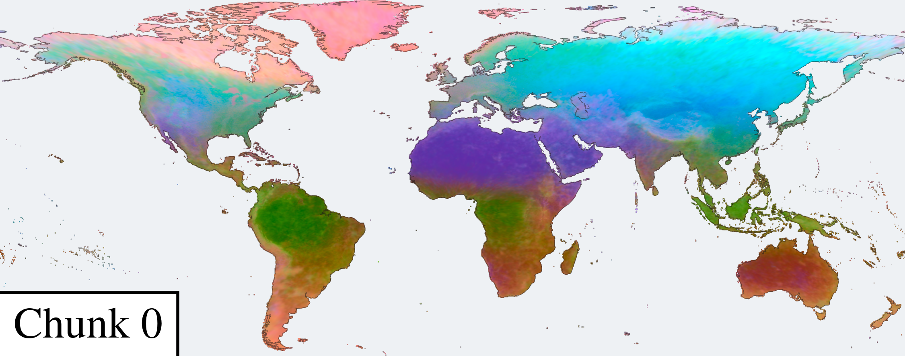
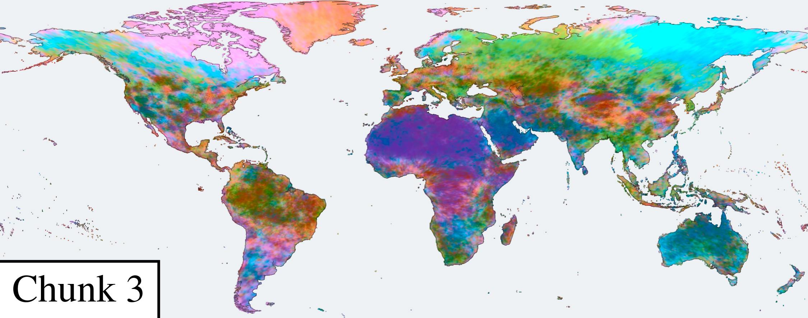
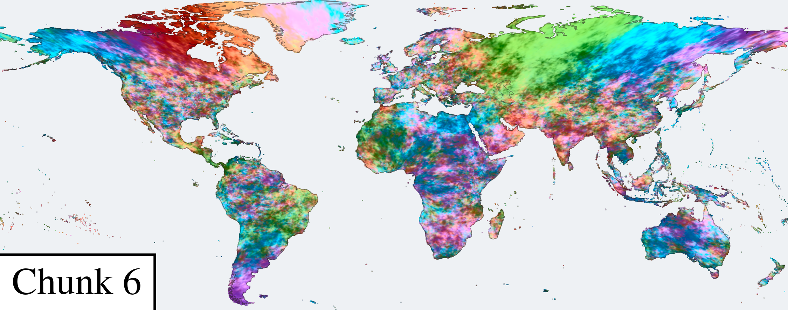
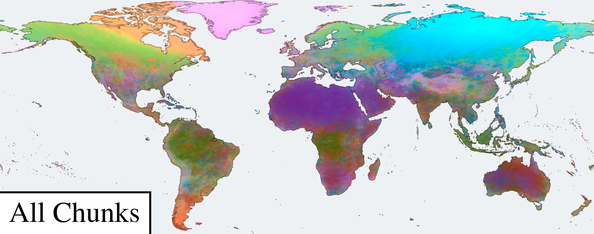

# Matryoshka Implicit Neural Distillation (MIND)

[](https://huggingface.co/taylor-geospatial/MIND)
[](https://huggingface.co/datasets/taylor-geospatial/CoordBench)
[](https://huggingface.co/datasets/taylor-geospatial/MINDSET)
[](https://research.taylorgeospatial.org/mind/)

[Isaac Corley](https://isaac.earth), [Arjun Rao](https://arjunashokrao.me/), [Esther Rolf](https://www.estherrolf.com/), [Konstantin Klemmer](https://konstantinklemmer.github.io/), [Evan Shelhamer](https://imaginarynumber.net/), [Nils Lehmann](https://nilsleh.github.io/), [Marc Rußwurm](https://marcrusswurm.com/), [Gengchen Mai](https://gengchenmai.github.io/), [Nathan Jacobs](https://jacobsn.github.io/), [Hannah Kerner](https://hannah-rae.github.io/)

MIND maps latitude and longitude to a geospatial embedding.
It distills AlphaEarth, Climplicit, GeoCLIP, and SINR into a 3072-dimensional ReSIREN, with prefixes at 64, 128, 256, 512, 1024, and 2048 dimensions.
Inference requires no imagery or date.

<p align="center">
  
</p>

Linear heads reconstruct teacher embeddings at each supervised width during training.
Downstream prediction uses the frozen encoder with truncation or the Chunked Penalty.

## Install

Install Python 3.13 and [uv](https://docs.astral.sh/uv/), then run:

```bash
make install
make check
```

Linux x86-64 uses CUDA FAISS; other platforms use CPU FAISS.
Large runs need a GPU, but `--device cpu` allows small runs.

## Artifacts

```bash
uv run hf download taylor-geospatial/MIND mind.safetensors --local-dir weights
uv run hf download taylor-geospatial/CoordBench --repo-type dataset --include 'data/*' --local-dir data/coordbench
uv run hf download taylor-geospatial/MINDSET --repo-type dataset --include '*.parquet' --local-dir data/mindset
```

## Load MIND

`from_pretrained()` downloads the released weights from Hugging Face.

```python
import numpy as np
from mind import embed, from_pretrained

model = from_pretrained()
lats = np.array([37.77, 51.51])
lons = np.array([-122.42, -0.13])
features = embed(model, lats, lons)       # [2, 64]
full = embed(model, lats, lons, dim=None)  # [2, 3072]
```

`mind_standalone.py` provides the same inference interface with PyTorch, NumPy, safetensors, and huggingface_hub.

### Torch Hub

```python
import torch

model = torch.hub.load("taylor-geospatial/mind", "mind", trust_repo=True)
coords = torch.tensor([[37.77, -122.42], [51.51, -0.13]])  # latitude, longitude
with torch.inference_mode():
    full = model(coords, return_features=True)  # [2, 3072]
    features = full[:, :64]                    # [2, 64]
```

### Hugging Face

To download the checkpoint explicitly and load it with `load_mind`:

```python
from huggingface_hub import hf_hub_download
from mind import load_mind

path = hf_hub_download("taylor-geospatial/MIND", "mind.safetensors")
model = load_mind(path)
```

Use `load_mind("weights/mind.safetensors")` or `load_mind("weights/mind.pt")` for a local checkpoint.

## Ridge with Chunked Penalty

Given training coordinates `train_lat`, `train_lon`, target values `y_train`, and test coordinates `test_lat`, `test_lon`:

```python
from mind import embed, fit_ridge_cp, from_pretrained

encoder = from_pretrained()
X_train = embed(encoder, train_lat, train_lon, dim=None)
X_test = embed(encoder, test_lat, test_lon, dim=None)

probe = fit_ridge_cp(X_train, y_train, alpha=1.0, beta=10.0)
y_pred = probe.predict(X_test)
```

Use full-width embeddings (`dim=None`) to include all seven MIND chunks.
The function standardizes features using training statistics and penalizes chunk `j` by `alpha * beta**j`, starting at `j=0`.
`beta=1` gives a uniform penalty across channels; larger values penalize later chunks more.
Choose `alpha` and `beta` on validation data.

## Embedding maps

<p align="center">
  
  
  <br>
  
  
</p>

The first three principal components map to RGB, with PCA fitted separately for each panel.
Early chunks show broad geographic patterns; later chunks show finer variation.
Explore the maps on the [project page](https://research.taylorgeospatial.org/mind/#map-section).

## Train

```bash
uv run python -m scripts.paper.train_combined --data data/mindset --name weights/mind
```

The loader joins the two MINDSET GeoParquet tables by `point_id`, decodes and L2-normalizes each annual AEF vector, then averages years per pixel.
Training uses roughly 48–50 GB of host memory; 64 GB of RAM is recommended.
Defaults are 12 residual blocks, 12,000 steps, batch size 2048, AdamW at 3e-4, four teachers, PHI-S target normalization, and supervision at all seven widths.
Training saves a `torch.save` encoder state dictionary and full-width teacher heads.
Use the released weights for evaluation; this training code and the cached float16 targets do not recreate them bit for bit.

## Evaluate

CoordBench contains 52 datasets and 78 targets.
Put the original SatCLIP L40 checkpoint at `weights/satclip-location-encoder.pt`; other comparison models download their weights on first use.

```bash
export COORDBENCH_ROOT="$PWD/data/coordbench"
export MIND_CHECKPOINT="$PWD/weights/mind.safetensors"

uv run python -m scripts.paper.blocksize_sweep \
  --cells 0 0.25 0.5 1 2 5 10 20 40 --fold-seed 0 \
  --out results/encoders-0.csv

uv run python -m scripts.paper.tikhonov_sweep \
  --cells 0 0.25 0.5 1 2 5 10 20 40 --fold-seed 0 \
  --out results/penalty-0.csv --choices-out results/choices-0.csv

uv run python -m scripts.paper.coord_interp_baseline \
  --cells 0 0.25 0.5 1 2 5 10 20 40 --ks 50 --fold-seed 0 \
  --out results/idw-0.csv
```

Repeat with fold seeds 0 through 4.
Cell 0 uses random folds; positive values hold out geographic cells of that width in degrees.
Cell width is not a minimum train-test distance.
`--only calhousing --no-baselines --device cpu` runs a small encoder comparison.
Set `MIND_EMBED_CACHE` to share cached features between runs.
`COORDBENCH_ROOT` must contain `data/<config>/data.parquet`; unset it to download tables from Hugging Face.
See [scripts/README.md](scripts/README.md) for aggregation, controls, and spatial analyses, or the [CoordBench guide](scripts/data/coordbench/README.md) for dataset construction and sources.

MIT licensed; see [LICENSE](LICENSE).
Upstream data and model licenses are recorded in their source repositories and the dataset provenance manifest.
